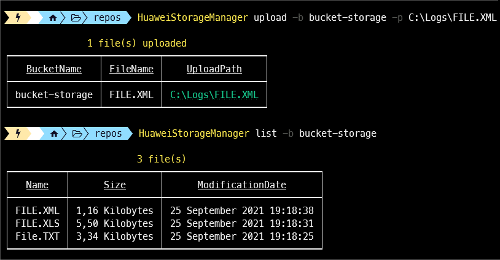

[](https://github.com/aimenux/HuaweiStorageManager/actions/workflows/ci.yml)

# HuaweiStorageManager
```
Providing net global tool in order to manage a huawei cloud storage
```

> In this repo, i m building a global tool that allows to manage a [huawei cloud storage](https://www.huaweicloud.com/intl/en-us/product/obs.html).
>
> The tool is based on multiple sub commmands :
> - Use sub command `List` to list files inside a bucket
> - Use sub command `Info` to get info about a file
> - Use sub command `Delete` to delete a file from bucket
> - Use sub command `Upload` to upload a file into bucket
> - Use sub command `Download` to download a file from bucket
> - Use sub command `Copy` to copy a file from bucket source to bucket target

>
> To run code in debug or release mode, type the following commands in your favorite terminal : 
> - `.\App.exe List -b [BucketName]`
> - `.\App.exe List -b [BucketName] -m 100`
> - `.\App.exe Info -b [BucketName] -f [FileName]`
> - `.\App.exe Delete -b [BucketName] -f [FileName]`
> - `.\App.exe Upload -b [BucketName] -f [FileName] -p [LocalFilePath]`
> - `.\App.exe Download -b [BucketName] -f [FileName] -p [LocalFilePath]`
> - `.\App.exe Copy -sb [SourceBucketName] -sf [SourceFileName] -tb [TargetBucketName] -tf [TargetFileName]`
>
> To install, run, update, uninstall global tool from a local source path, type commands :
> - `dotnet tool install -g --configfile .\Nugets\local.config HuaweiStorageManager`
> - `HuaweiStorageManager -h`
> - `HuaweiStorageManager -s`
> - `HuaweiStorageManager List -b [BucketName]`
> - `HuaweiStorageManager List -b [BucketName] -m 100`
> - `HuaweiStorageManager Info -b [BucketName] -f [FileName]`
> - `HuaweiStorageManager Delete -b [BucketName] -f [FileName]`
> - `HuaweiStorageManager Upload -b [BucketName] -f [FileName] -p [LocalFilePath]`
> - `HuaweiStorageManager Download -b [BucketName] -f [FileName] -p [LocalFilePath]`
> - `HuaweiStorageManager Copy -sb [SourceBucketName] -sf [SourceFileName] -tb [TargetBucketName] -tf [TargetFileName]`
> - `dotnet tool update -g HuaweiStorageManager --ignore-failed-sources`
> - `dotnet tool uninstall -g HuaweiStorageManager`
>
> To install global tool from [nuget source](https://www.nuget.org/packages/HuaweiStorageManager), type these command :
> - For stable version : `dotnet tool install -g HuaweiStorageManager --ignore-failed-sources`
> - For prerelease version : `dotnet tool install -g HuaweiStorageManager --version "*-*" --ignore-failed-sources`
>
>
> 
>

**`Tools`** : vs19, net 5.0, huawei obs, fluent validations, spectre console
